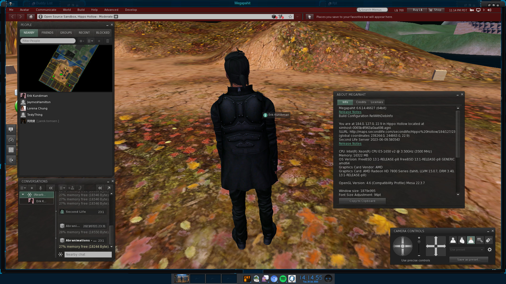

<picture>
  <source media="(prefers-color-scheme: dark)" srcset="doc/sl-logo-dark.png">
  <source media="(prefers-color-scheme: light)" srcset="doc/sl-logo.png">
  
</picture>

**[Second Life][] is a free 3D virtual world where users can create, connect and chat with others from around the
world.** This repository contains a fork of the source code for the official client.

## Open Source

Second Life provides a huge variety of tools for expression, content creation, socialization and play. Its vibrancy is
only possible because of input and contributions from its residents. The client codebase has been open source since
2007 and is available under the LGPL license. The [Open Source Portal][] contains additional information about Linden
Lab's open source history and projects.

## Download

Most people use a pre-built viewer release to access Second Life. Windows and macOS builds are
[published on the official website][download]. More experimental viewers, such as release candidates and
project viewers, are detailed on the [Alternate Viewers page](https://releasenotes.secondlife.com/viewer.html).

### Third Party Viewers

Third party maintained forks, which include Linux compatible builds, are indexed in the [Third Party Viewer Directory][tpv].

## Build Instructions

[Windows](https://wiki.secondlife.com/wiki/Build_the_Viewer_on_Windows)

### macOS

```
# port install git cmake pkgconfig apr-util boost collada-dom freealut hunspell jsoncpp libsdl2 uriparser VLC
$ export LL_BUILD="-DLL_DARWIN=1 -DPIC -fPIC -gdwarf-2 -stdlib=libc++ -iwithsysroot /Applications/Xcode.app/Contents/Developer/Platforms/MacOSX.platform/Developer/SDKs/MacOSX.sdk -DLL_RELEASE=1 -DLL_RELEASE_FOR_DOWNLOAD=1"
```

### GNU/Linux

```
# apt install git cmake pkg-config libalut-dev libaprutil-dev libboost-fiber-dev libboost-program-options-dev libboost-regex-dev libcollada-dom-dev libcurl4-openssl-dev libexpat1-dev libglu1-mesa-dev libgtk2.0-dev libhunspell-dev libjsoncpp-dev libmeshoptimizer-dev libnghttp2-dev libopenjp2-dev libsdl2-dev liburiparser-dev libvlc-dev libvlccore-dev libvorbis-dev libxmlrpc-epi-dev libxxhash-dev
$ export LL_BUILD="-DLL_LINUX=1 -fPIC"
```

### FreeBSD

```
# portmaster devel/git devel/cmake devel/pkgconf devel/apr1 devel/collada-dom devel/sdl20 devel/xxhash audio/freealut audio/libvorbis graphics/openjpeg misc/meshoptimizer multimedia/vlc net/uriparser net/xmlrpc-epi textproc/hunspell x11-toolkits/gtk20
$ setenv LL_BUILD "-DLL_FREEBSD=1 -fPIC"
```

### Common

```
$ cd viewer
$ git remote add megapahit https://megapahit.org/viewer.git
$ git fetch megapahit
$ git checkout megapahit/main
$ mkdir -p build
$ cd build
$ cmake -DCMAKE_BUILD_TYPE:STRING=Release -DADDRESS_SIZE:INTERNAL=64 -DUSESYSTEMLIBS:BOOL=ON -DUSE_OPENAL:BOOL=ON -DLL_TESTS:BOOL=OFF -DNDOF:BOOL=OFF -DVIEWER_CHANNEL:STRING=Megapahit -DVIEWER_BINARY_NAME:STRING=megapahit -DBUILD_SHARED_LIBS:BOOL=ON -DPACKAGE:BOOL=OFF -DINSTALL:BOOL=ON -DOpenGL_GL_PREFERENCE:STRING=LEGACY ../indra
$ make -j12
$ sudo make install
$ megapahit
```

## Example



Running natively on FreeBSD (not with Linux binary compatibility).

## Contribute

Help make Second Life better! You can get involved with improvements by filing bugs, suggesting enhancements, submitting
pull requests and more. See the [open source portal][] for details.

[Second Life]: https://secondlife.com/
[download]: https://secondlife.com/support/downloads/
[tpv]: http://wiki.secondlife.com/wiki/Third_Party_Viewer_Directory
[open source portal]: http://wiki.secondlife.com/wiki/Open_Source_Portal
